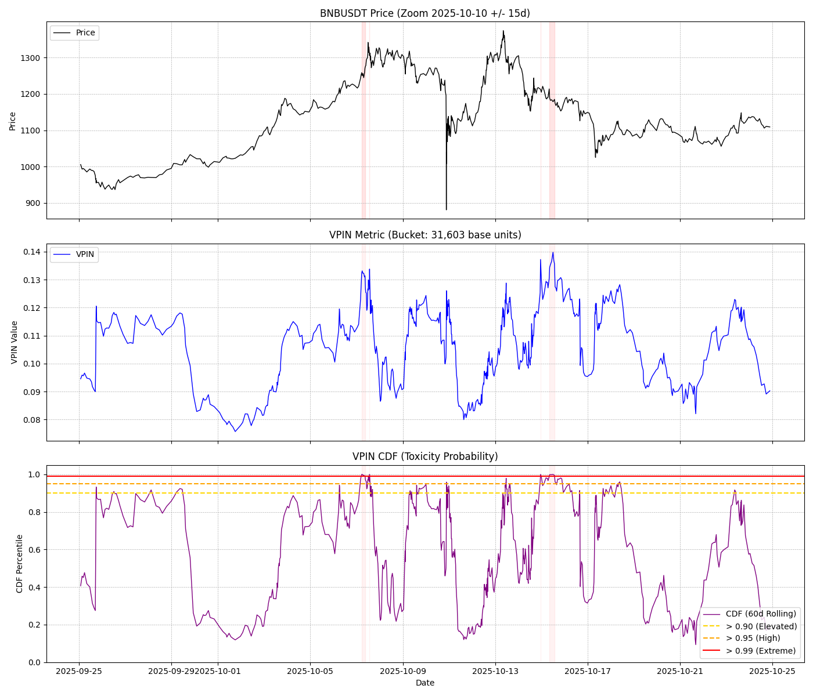

# VPIN Calculator (Binance 1m)

Compute the Volume-Synchronized Probability of Informed Trading (VPIN) for Binance symbols using 1-minute klines. The scripts fetch/cache historical data, build volume buckets, calculate VPIN plus a rolling CDF "toxicity" score, and plot the results. Includes a backtest framework to optimize parameters for drawdown avoidance.

## Repository contents
- `market_data.py` – async downloader for 1m klines with retry/backoff; maintains a feather cache (`bnbusdt_1m.feather`) and can back/forward fill gaps.
- `vpin_calculator.py` – builds volume buckets, computes VPIN and rolling CDF, saves CSV results, and generates plots.
- `vpin_backtest.py` – backtests a VPIN-based exit strategy (exit when CDF >= 0.99, 2-day cooldown) with parameter sweeps.
- `vpin_optuna_optimize.py` – Bayesian optimization (Optuna) to find parameters maximizing avoided drawdown.
- `config.json` – runtime parameters (symbol, bucket sizing, windows, start date).
- `docs/` – contains detailed VPIN methodology notes (`VPIN_info_*.md`).
- `consistency_report.md` & `consistency_report_book.md` – verification reports checking code against theoretical documentation.

## Requirements
- Python 3.10+
- Packages: `pandas`, `numpy`, `aiohttp`, `matplotlib`, `pyarrow` (for feather I/O)

Example setup:
```bash
python -m venv .venv
source .venv/bin/activate        # Windows: .\.venv\Scripts\activate
pip install --upgrade pip
pip install pandas numpy aiohttp matplotlib pyarrow
```

## Configuration
`config.json` controls the run:
- `symbol`: Binance symbol, e.g., `BNBUSDT`.
- `bucket_target_bars_per_day`: desired number of volume buckets per day (50 is common in VPIN literature).
- `adv_lookback_days`: days used to estimate ADV for bucket sizing.
- `bucket_size_base`: manual bucket size override in base units; leave `null` to auto-size from ADV/local data.
- `vpin_window`: rolling bucket window for VPIN numerator (default 50).
- `cdf_lookback_days`: rolling time window (days) for percentile ranking of VPIN.
- `start_date`: earliest candle to load/analyze (YYYY-MM-DD).

## Usage
1) **Download/refresh klines**
```bash
python market_data.py
```
This loads `bnbusdt_1m.feather` if present, fetches missing data from Binance (handles 429/418 responses with backoff), and saves the updated cache. It skips downloads if the cache was modified within the last 15 minutes.

2) **Calculate VPIN and plots**
```bash
python vpin_calculator.py
```
This will:
- Determine bucket size `V` (ADV / `bucket_target_bars_per_day`, or override if provided).
- Build volume buckets from 1m data (buy volume = taker buy base; sell volume = total - buy).
- Compute VPIN and a rolling CDF percentile.
- Save `vpin_results.csv`, `vpin_plot.png`, and `vpin_plot_oct_zoom.png` (center date is set in the script; adjust if desired).

### Sample output (Oct zoom)


## Interpreting results
- VPIN is between 0 and 1; higher values indicate greater order-flow imbalance.
- The CDF line gives a percentile of current VPIN vs. recent history (`cdf_lookback_days` window). Rule-of-thumb alerts:
  - > 0.90: elevated
  - > 0.95: high
  - > 0.99: extreme (potential liquidity stress/flow toxicity)

## Methodology snapshot
- Bucket size: `V = ADV / bucket_target_bars_per_day` (or override).
- Candles are split fractionally to form constant‑volume buckets of size `V`.
- **Bucket Pricing:** Uses **Median Price** `(High + Low) / 2` for each bucket (aligned with Chapter 22 recommendations).
- `VPIN_t = sum(|B−S|)/(n*V)` over `vpin_window`; CDF percentile over `cdf_lookback_days`.

## Backtest & Parameter Optimization

The repository includes tools to backtest a VPIN-based trading strategy and optimize parameters.

### Strategy
- **Default position**: Always long (exposed to market)
- **Exit signal**: When VPIN CDF >= 0.99 (extreme toxicity)
- **Cooldown**: Stay out of market for 2 days after exit
- **Re-entry**: Automatically re-enter after cooldown

### Running the backtest
```bash
python vpin_backtest.py      # Grid search over parameter combinations
python vpin_optuna_optimize.py  # Bayesian optimization (Optuna)
```

### Optimized Parameters (BNBUSDT 2020-2026)
Using Optuna to maximize cumulative avoided drawdown with >= 30 exit signals:

| Parameter | Optimized Value |
|-----------|-----------------|
| Buckets per day | 252 |
| VPIN Window | 10 |
| Cumulative Avoided DD | 1607.4% |
| Signal Success Rate | 95.2% |
| Total Exits | 334 |

These parameters are now the defaults in `config.json`.

### Output files
- `vpin_backtest_results.csv` – grid search results
- `vpin_optuna_results.csv` – Optuna trial results
- `vpin_backtest_equity.png` – equity curve comparison vs buy-and-hold

## Notes
- If you point `symbol` to something other than the cached data, run `market_data.py` first to build a fresh feather file.
- The downloader is conservative with request pacing but Binance rate limits still apply; very long histories may need multiple runs.
- See `docs/` for methodology details and `consistency_report_book.md` for verification against the standard literature.
